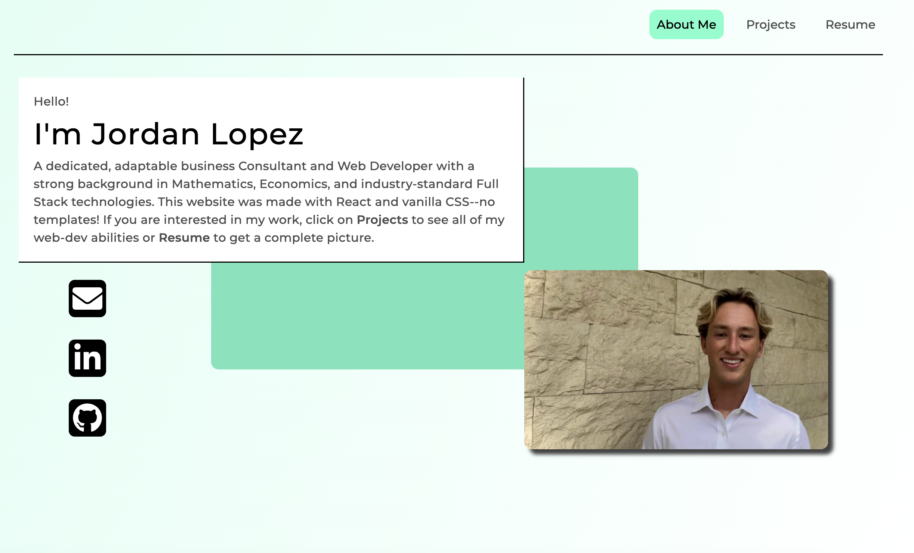

# Jordan's Portfolio
[explore the site here!](https://snazzy-travesseiro-fba125.netlify.app)

## Description
This is a portfolio website made with react! You can see my skills, my github, linkedIn and email me!
 
For this site, I used `React Browser Router` to control the url endpoints and React Hooks like `useState` for added functionality.

## Installation
To install on your own machine, simply clone down my repo, run `npm install` at the root directory, then run `npm run dev` in order to start the client server!

## License
This application is covered under the MIT license.

## Questions
For questions about the project, you can reach me via:
- GitHub: [Lopez-Jordan](https://github.com/Lopez-Jordan)
- Email: jordanlopezemail@gmail.com
